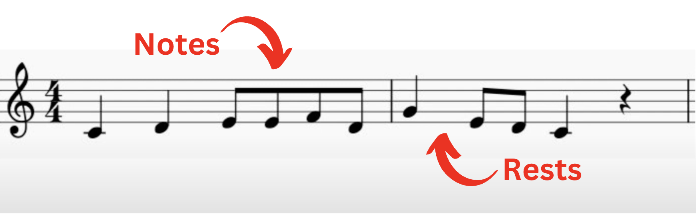
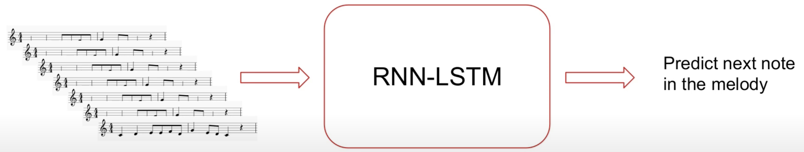
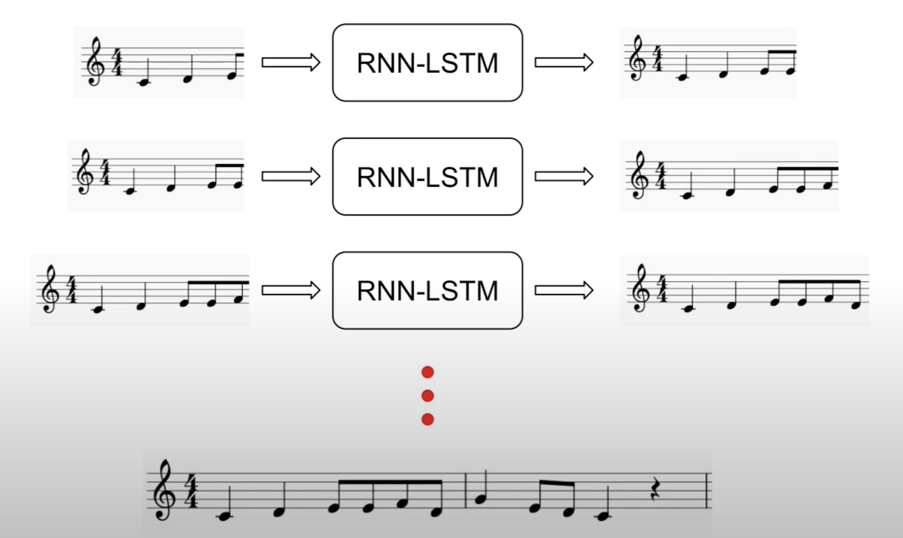

# music-generation-with-RNN-LSTM

## Steps to run the application locally

- server application

1. cd into the server folder
   `cd server`
2. build the docker image
   `docker build -t rhythm-genius`
3. run the docker image
   `docker run --init -it -p 8000:8000 rhythm-genius`

- client application

1. cd into the client folder
   `cd client`
2. install dependencies
   `npm install`
3. run the application
   `npm run dev`

## Problem Statement

To create a music generation system that can generate new melodies using an RNN-LSTM model. The system will be trained on a dataset of folk melodies, and it will be able to generate new melodies that are similar to the melodies in the training dataset.

## Basics of melody

  

- A melody is a squence of notes and rests.
- On the y-axis you have the pitch (frequency), the higher it goes, the higher is the pitch. And, on the x-axis you have time.
- So, we are noting pitches of musical events in time.
- Because of that we can treat melody as a time series.
- Time series is a data structure where you have samples that are taken at equally spaced position in time.
- The whole melody generation now becomes a time-series prediction problem (Basically, we want to predict the next sample in a time series)
- First of all we will have to reduce all the notes to a given vocabulary of accepted musical events like pitches and rests which are moments of silence.

## The music generator (training)

  
For training our neural network what we do is basically we pass in chunks of music and then we ask the LSTM (Long Short-Term Memory) to predict the next notes in the music

## The music generator (inference)

  

- We start with a seed melody
- The model is going to give us a prediction. And, the prediction is going to be the next predicted notes in the music.
- We take that and append it to the initial seed and re-feed that again to the model and we expect yet another prediction from the model which is the next in the sequence.
- We continue with the third iteration we pass in the melody and now we get another prediction which is for the next note.
- So, we can basically a whole music starting from the seed just by going through each iteration.

## Why use an RNN-LSTM?

- Melodies have long-term structural patterns (they have patterns that repeat, they get slightly modified in the pitch content or they get stretched or shrunk.
- LSTMs are really good at capturing long-term temporal dependencies.
- So, they are particularly good to kind of like recreate these structures and patterns.
- For these reasons LSTMs are extensively used for generating music because they have understanding and memory capacity to handle long chunks of music.

## The dataset

- We are going to be using a data set that has a bunch of folk melodies.
- ESAC dataset (20K+ songs from all over the world)

## Tools and libraries

- [Keras/Tensorflow](https://keras.io/) (Deep Learning libraries)
- [Music21](https://web.mit.edu/music21/) (Python library for processing symbolic music data)
- [MuseScore](https://musescore.org/en) (For music notation)

## This project is a collaboration between the following team members:

| Name           | Roll Number | Email                                                               | Mobile     |
| -------------- | ----------- | ------------------------------------------------------------------- | ---------- |
| Pratik Kithani | 2003094     | [pratikkithani3112@gmail.com](mailto:pratikkithani3112@gmail.com)   | 9325996995 |
| Kishan Kokal   | 2003095     | [kokalkishan1072@gmail.com](mailto:kokalkishan1072@gmail.com)       | 9920594378 |
| Shubham Mandal | 2003105     | [shubhammandal20221@gmail.com](mailto:shubhammandal20221@gmail.com) | 7498992443 |
| Harsh Punjabi  | 2003136     | [punjabiharsh52@gmail.com](mailto:punjabiharsh52@gmail.com)         | 9422424131 |

## The team is working with the following mentor:

Dr. Anagha Durugkar, a professor at Thadomal Shahani Engineering College
